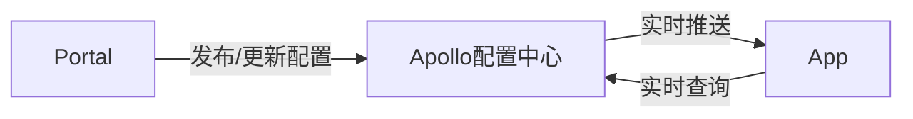

# 欢迎使用布丁笔记

**布丁笔记**是一款专注写作和管理的小众软件

### 代码展示

```js
const _ = require('lodash')

_.uniq([2, 1, 2]) // => [2, 1]
```

```sh
# install globally
yarn global add vuepress@next # OR npm install -g vuepress@next

# create a markdown file
echo '# Hello VuePress' > README.md

# start writing
vuepress dev

# build
vuepress build
```

### 表格

GFM table

| Item      |    Value | Qty  |
| :-------- | --------:| :--: |
| Computer  | 1600 USD |  5   |
| Phone     |   12 USD |  12  |
| Pipe      |    1 USD | 234  |

### LaTex 公式

行内公式，例如 $\sqrt{3x-1}+(1+x)^2$

块级公式，例如

$$\begin{array}{c}

\nabla \times \vec{\mathbf{B}} -\, \frac1c\, \frac{\partial\vec{\mathbf{E}}}{\partial t} &
= \frac{4\pi}{c}\vec{\mathbf{j}}    \nabla \cdot \vec{\mathbf{E}} & = 4 \pi \rho \\

\nabla \times \vec{\mathbf{E}}\, +\, \frac1c\, \frac{\partial\vec{\mathbf{B}}}{\partial t} & = \vec{\mathbf{0}} \\

\nabla \cdot \vec{\mathbf{B}} & = 0

\end{array}$$

### 流程图

```flow
st=>start: Start
e=>end
op=>operation: My Operation
cond=>condition: Yes or No?

st->op->cond
cond(yes)->e
cond(no)->op
```

以及时序图:

```sequence
Alice->Bob: Hello Bob, how are you?
Note right of Bob: Bob thinks
Bob-->Alice: I am good thanks!
```



### 复选框

GFM Task List

使用 `- [ ]` 和 `- [x]` 语法可以创建复选框，实现 todo-list 等功能。例如：

- [x] 已完成事项
- [ ] 待办事项1
- [ ] 待办事项2

### 普通语法

1. 列表项
1. 列表项
   1. 子列表项
   1. 子列表项

- 无序列表
- 无序列表
- 无序列表

> blockquote

`行内代码`

### emoji

:D  :)  :-)  :-(

### imsize


### images

